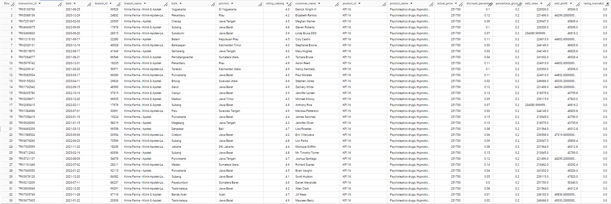

# **Virtual Internship Experience: Big Data Analytics - Kimia Farma**

## **Program Description**
In my role as a Big Data Analytics Intern at Kimia Farma, I am tasked with analyzing the business performance of the company spanning from 2020 to 2023. My responsibilities include creating an analysis table and presenting reports through a dashboard to assess Kimia Farma's business performance throughout the specified timeframe. The analysis table was implemented using the BigQuery platform, while the dashboard was developed using Looker Studio.<br>

**Objectives**
- Design data analysis table from the existing raw dataset
- Design company performance report visualization/dashboard
<br>

**Dataset** <br>
The dataset provided consists of the following tables:
- kf_final_transaction
- kf_inventory
- kf_kantor_cabang
- kf_product
> The dataset can also be accessed through the folder: raw-data
<br>

**Tools** <br>
Tool : Google Cloud BigQuery <br>
Visualization : Looker Data Studio - [https://lookerstudio.google.com/s/qgr_JPexnm8](https://lookerstudio.google.com/s/qgr_JPexnm8) <br>

---


## **Data Analysis**
As a data analyst, your have to create a summary table by combining the data from the provided raw table, with the following mandatory columns:
- transaction_id : kode id transaksi
- date : tanggal transaksi dilakukan
- branch_id : kode id cabang Kimia Farma
- branch_name : nama cabang Kimia Farma
- kota : kota cabang Kimia Farma
- provinsi : provinsi cabang Kimia Farma
- rating_cabang : penilaian konsumen terhadap cabang Kimia Farma
- customer_name : Nama customer yang melakukan transaksi
- product_id : kode product obat
- product_name : nama obat
- actual_price : harga obat
- discount_percentage : Persentase diskon yang diberikan pada obat
- persentase_gross_laba : Persentase laba yang seharusnya diterima dari obat dengan ketentuan berikut:
  - Harga <= Rp 50.000 -> laba 10%
  - Harga > Rp 50.000 - 100.000 -> laba 15%
  - Harga > Rp 100.000 - 300.000 -> laba 20%
  - Harga > Rp 300.000 - 500.000 -> laba 25%
  - Harga > Rp 500.000 -> laba 30%,
- nett_sales : harga setelah diskon
- nett_profit : keuntungan yang diperoleh Kimia Farma
- rating_transaksi : penilaian konsumen terhadap transaksi yang dilakukan.


<details>
  <summary> Click to see query </summary>
    <br>
    
```sql
CREATE TABLE kimia_farma.kf_analysis AS
SELECT tr.transaction_id, 
  tr.date, 
  tr.branch_id, 
  kc.branch_name, 
  kc.kota, 
  kc.provinsi, 
  kc.rating AS rating_cabang, 
  tr.customer_name, 
  tr.product_id, 
  pd.product_name, 
  pd.price AS actual_price, 
  tr.discount_percentage,
  CASE
    WHEN pd.price <= 50000 then 0.1
    WHEN pd.price > 50000 AND pd.price <= 100000 then 0.15
    WHEN pd.price > 100000 AND pd.price <= 300000 then 0.2
    WHEN pd.price > 300000 AND pd.price <= 500000 then 0.25
    ELSE 0.3      --pd.price >500000 
    END AS persentase_gross_laba,
  (pd.price * (1-tr.discount_percentage)) AS nett_sales,
  ((pd.price * (1-tr.discount_percentage)) - tr.price)AS nett_profit,
  tr.rating AS rating_transaksi
FROM kimia_farma.kf_final_transaction AS tr 
  LEFT JOIN kimia_farma.kf_kantor_cabang AS kc 
  ON (tr.branch_id = kc.branch_id)
  LEFT JOIN kimia_farma.kf_product AS pd
  ON (tr.product_id = pd.product_id)
;
```
    
<br>
</details>
<br>

<p align="center">
    <kbd>  </kbd> <br>
    Tabel Hasil Analisis
</p>
<br>

---

## **Data Visualization**

[[See Looker Studio](https://lookerstudio.google.com/s/qgr_JPexnm8)

To support visualization, a new table was generated to explore the top five branches with the best ratings but the lowest transaction ratings:
<details>
  <summary> Click to see query </summary>
    <br>
    
```sql
CREATE TABLE kimia_farma.kf_branch_analysis_lim AS
SELECT kc.branch_id, 
  kc.branch_name, 
  AVG(tr.rating) AS rating_transaction,
  kc.rating AS rating_branch
FROM kimia_farma.kf_kantor_cabang AS kc
  LEFT JOIN kimia_farma.kf_final_transaction AS tr
  ON (kc.branch_id = tr.branch_id)
GROUP BY kc.branch_id, kc.branch_name, kc.rating
ORDER BY AVG(tr.rating) ASC, kc.rating DESC
LIMIT 5
;
```
<br>
</details>
<br>

<p align="center">
    <kbd>  </kbd> <br>
    Performance Analytics Kimia Farma Dashboard
</p>
<br>

---
